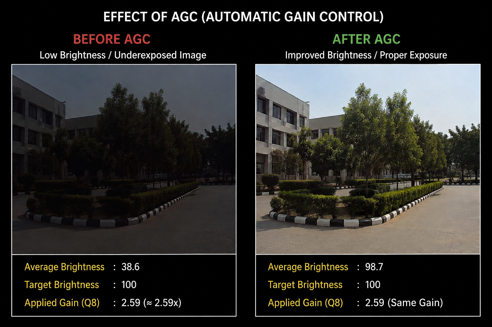

# Auto-Gain-Controller--ISP
Developed a beginner-level AGC image-processing project in Verilog using Vivado. It uses a frame buffer to store 9 pixels, calculates average brightness, accepts a target value, calculates Q8 gain, applies gain with saturation, and verifies the complete design through simulation.
# What is AGC (Auto Gain Controller) 
AGC (Automatic Gain Control) is an ISP feature that automatically adjusts the sensor gain to maintain proper image brightness under different lighting conditions. It analyzes the image brightness and increases or decreases the gain accordingly.
## Example

### Before and After AGC

## Working Principal
Step 1: Calculate Average Brightness
Read 9 pixels from the input frame
Add all pixel values
Divide the total sum by the number of pixels
The result represents the average brightness of the frame

Example:
Pixels = 10,20,30,40,50,60,70,80,80
Sum    = 440
Average = 440 / 9 = 48
